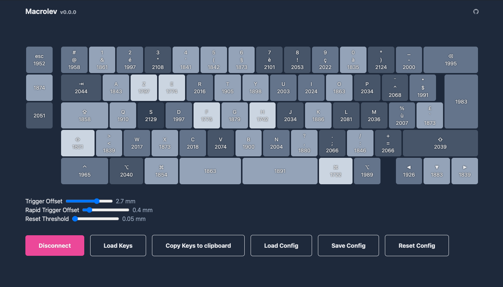

# Macrolev

Custom analog keyboard based on Hall Effect switches.

- [keyboard layout](http://www.keyboard-layout-editor.com/#/gists/9dc992fd631d9f29cc5bdf738b10b4e4)
- [Onshape project](https://cad.onshape.com/documents/2af2025c576c4f084cb26625/w/9564bb1d9dfbd4b4af4294c8/e/e2406b8294380372b9116245)
- [Rev 1.0 Schema](https://kicanvas.org/?github=https%3A%2F%2Fgithub.com%2Fheiso%2Fmacrolev%2Fblob%2Frev-1.0%2Fkicad%2Fmacrolev.kicad_sch)
- [Rev 1.0 Pcb](https://kicanvas.org/?github=https%3A%2F%2Fgithub.com%2Fheiso%2Fmacrolev%2Fblob%2Frev-1.0%2Fkicad%2Fmacrolev.kicad_pcb)
- [WIP Rev 1.1 Schema](https://kicanvas.org/?github=https%3A%2F%2Fgithub.com%2Fheiso%2Fmacrolev%2Fblob%2Fmain%2Fkicad%2Fmacrolev.kicad_sch)
- [WIP Rev 1.1 Pcb](https://kicanvas.org/?github=https%3A%2F%2Fgithub.com%2Fheiso%2Fmacrolev%2Fblob%2Fmain%2Fkicad%2Fmacrolev.kicad_pcb)
- [Web Configurator](https://heiso.github.io/macrolev/)
  

## Todo

### Must Have

- ~~Move from RP2040 to STM32F4 mcu~~
- ~~debug adc values~~
- ~~change keyboard descriptor~~

### Should Have

- ~~Rapid trigger~~
- web configurator
- haptic feedback

### Could Have

- Trackpad
- C to Rust
- jtag

## Ref

- ~~[RP2040 Datasheet](https://datasheets.raspberrypi.com/rp2040/rp2040-datasheet.pdf)~~
- ~~[RP2040 Hardware Design](https://datasheets.raspberrypi.com/rp2040/hardware-design-with-rp2040.pdf)~~
- ~~[kb2040 doc](https://learn.adafruit.com/adafruit-kb2040/downloads)~~
- ~~[RPi Pico Debugger Shoe](https://github.com/ShawnHymel/rpi-pico-debugger-shoe)~~
- [Dilemma keyboard](https://github.com/Bastardkb/Dilemma)
- [0xB2 - splinky](https://github.com/plut0nium/0xB2)
- [Sub Reddit](https://www.reddit.com/r/PrintedCircuitBoard/search/?q=rp2040&restrict_sr=1&sr_nsfw=&include_over_18=1)
- [layout/design ref](https://geekhack.org/index.php?topic=103671.0)
- [cirque trackpad](https://www.cirque.com/glidepoint-circle-trackpads)
- [MagLev_Switch_MX](https://github.com/famichu/MagLev_Switch_MX)
- [Anatomy of a keyboard](https://matt3o.com/anatomy-of-a-keyboard/)
- [Switches/Stabs Kicad footprints from ebastler/marbastlib](https://github.com/ebastler/marbastlib)
- [Reddit Post about someone building a lekker switch based keyboard](https://www.reddit.com/r/PrintedCircuitBoard/comments/152kt63/review_request_analog_hall_effect_75_iso_keyboard/)
- [Riskable projects](https://github.com/riskable)
- [Fluxpad with lekker switches](https://github.com/sssata/fluxpad)
- [STM32F411CEU6 documentation](https://www.st.com/en/microcontrollers-microprocessors/stm32f411ce.html#documentation)
- [Wooting 60HE pcb](https://github.com/heiso/macrolev/tree/main/ref/Wooting-60HE)
- [Connecting to uncommon HID devices](https://developer.chrome.com/articles/hid)
- [HID Descriptor parser](https://eleccelerator.com/usbdescreqparser/)

## Tooling

- [QMK keyboard test](https://config.qmk.fm/#/test)
- [Keyboard ghosting interactive demonstration](https://www.microsoft.com/applied-sciences/projects/anti-ghosting-demo)
- [JLC2KiCad_lib](https://github.com/TousstNicolas/JLC2KiCad_lib)
- [Debug HardFault](https://interrupt.memfault.com/blog/cortex-m-hardfault-debug)

## PCB reviews

[Review request on PrintedCircuitBoard](https://www.reddit.com/r/PrintedCircuitBoard/comments/17hjp88/review_request_analog_keyboard)  
[Second review request on PrintedCircuitBoard](https://www.reddit.com/r/PrintedCircuitBoard/comments/17kqc2j/review_request_analog_keyboard_2/)
