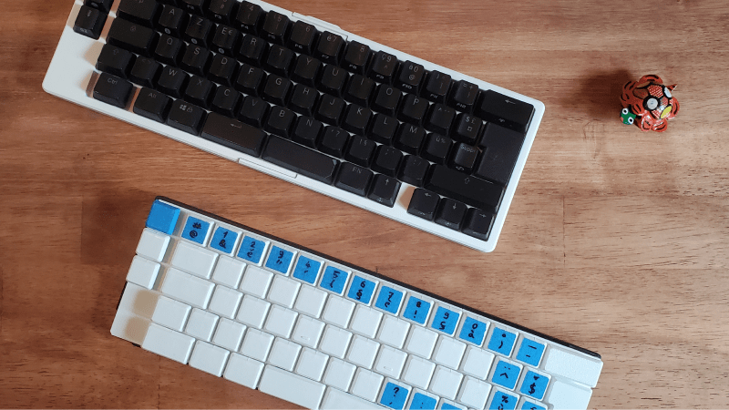

# Macrolev - custom analog keyboard

  
[bottom picture](assets/keyboard-bot.png) - [pcb picture](assets/pcb-bot.png)

I use the two prototypes shown above as my daily drivers for both coding and gaming. They work well, and the current state of the web configurator is sufficient for seamlessly switching between coding and gaming modes. The current layout of my prototypes is Mac ISO azerty (FR).

## Features

- **Analog Input:** Each key detects varying levels of pressure thanks to Hall Effect technology, allowing for a more responsive and sensitive typing experience.
- **Rapid Trigger Support:** Enables keys to actuate without fully releasing, allowing for faster response times during intense usage (e.g., gaming or rapid typing).
- **Continuous Rapid Trigger:** For keys that require repeated pressing (e.g., in gaming), this feature allows automatic repeated key input with a single press.
- **Tap and Hold Functionality:** Each key can be assigned two functions. A tap function for quick presses and a hold function for longer presses. This is ideal for combining shortcuts or creating multi-functional keys, such as assigning the right Shift key to act as an arrow up when tapped.
- **Web-Based Configurator:** Allows customization of key sensitivity and rapid trigger settings, with future updates planned to enable key mapping and expanded functionality. (see [screenshot](assets/web-configurator-screenshot.png))

## Links

- [keyboard layout](http://www.keyboard-layout-editor.com/#/gists/9dc992fd631d9f29cc5bdf738b10b4e4)
- [Onshape - Case](https://cad.onshape.com/documents/2af2025c576c4f084cb26625/w/9564bb1d9dfbd4b4af4294c8/e/e2406b8294380372b9116245)
- [Onshape - Low profile MX keycaps](https://cad.onshape.com/documents/93ff700fd3fbb6e9cde6f6e3)
- [Rev 1.0 Schema](https://kicanvas.org/?github=https%3A%2F%2Fgithub.com%2Fheiso%2Fmacrolev%2Fblob%2Frev-1.0%2Fkicad%2Fmacrolev.kicad_sch)
- [Rev 1.0 Pcb](https://kicanvas.org/?github=https%3A%2F%2Fgithub.com%2Fheiso%2Fmacrolev%2Fblob%2Frev-1.0%2Fkicad%2Fmacrolev.kicad_pcb)
- [WIP Rev 1.1 Schema](https://kicanvas.org/?github=https%3A%2F%2Fgithub.com%2Fheiso%2Fmacrolev%2Fblob%2Fmain%2Fkicad%2Fmacrolev.kicad_sch)
- [WIP Rev 1.1 Pcb](https://kicanvas.org/?github=https%3A%2F%2Fgithub.com%2Fheiso%2Fmacrolev%2Fblob%2Fmain%2Fkicad%2Fmacrolev.kicad_pcb)
- [Web Configurator](https://heiso.github.io/macrolev/)

## Misc

### References

- ~~[RP2040 Datasheet](https://datasheets.raspberrypi.com/rp2040/rp2040-datasheet.pdf)~~
- ~~[RP2040 Hardware Design](https://datasheets.raspberrypi.com/rp2040/hardware-design-with-rp2040.pdf)~~
- ~~[kb2040 doc](https://learn.adafruit.com/adafruit-kb2040/downloads)~~
- ~~[RPi Pico Debugger Shoe](https://github.com/ShawnHymel/rpi-pico-debugger-shoe)~~
- [Dilemma keyboard](https://github.com/Bastardkb/Dilemma)
- [0xB2 - splinky](https://github.com/plut0nium/0xB2)
- [Sub Reddit](https://www.reddit.com/r/PrintedCircuitBoard/search/?q=rp2040&restrict_sr=1&sr_nsfw=&include_over_18=1)
- [layout/design ref](https://geekhack.org/index.php?topic=103671.0)
- [cirque trackpad](https://www.cirque.com/glidepoint-circle-trackpads)
- [MagLev_Switch_MX](https://github.com/famichu/MagLev_Switch_MX)
- [Anatomy of a keyboard](https://matt3o.com/anatomy-of-a-keyboard/)
- [Switches/Stabs Kicad footprints from ebastler/marbastlib](https://github.com/ebastler/marbastlib)
- [Reddit Post about someone building a lekker switch based keyboard](https://www.reddit.com/r/PrintedCircuitBoard/comments/152kt63/review_request_analog_hall_effect_75_iso_keyboard/)
- [Riskable projects](https://github.com/riskable)
- [Fluxpad with lekker switches](https://github.com/sssata/fluxpad)
- [STM32F411CEU6 documentation](https://www.st.com/en/microcontrollers-microprocessors/stm32f411ce.html#documentation)
- [Wooting 60HE pcb](https://github.com/heiso/macrolev/tree/main/ref/Wooting-60HE)
- [Connecting to uncommon HID devices](https://developer.chrome.com/articles/hid)
- [HID Descriptor parser](https://eleccelerator.com/usbdescreqparser/)

### Tooling

- [QMK keyboard test](https://config.qmk.fm/#/test)
- [Keyboard ghosting interactive demonstration](https://www.microsoft.com/applied-sciences/projects/anti-ghosting-demo)
- [JLC2KiCad_lib](https://github.com/TousstNicolas/JLC2KiCad_lib)
- [Debug HardFault](https://interrupt.memfault.com/blog/cortex-m-hardfault-debug)

### PCB reviews

- [Review request on PrintedCircuitBoard](https://www.reddit.com/r/PrintedCircuitBoard/comments/17hjp88/review_request_analog_keyboard)
- [Second review request on PrintedCircuitBoard](https://www.reddit.com/r/PrintedCircuitBoard/comments/17kqc2j/review_request_analog_keyboard_2/)
